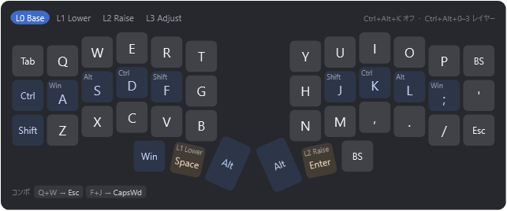
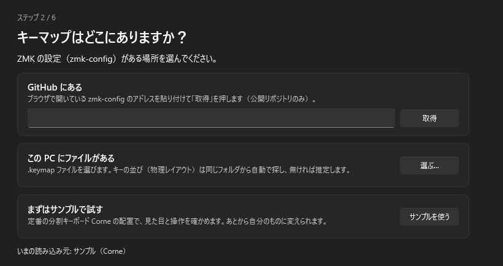
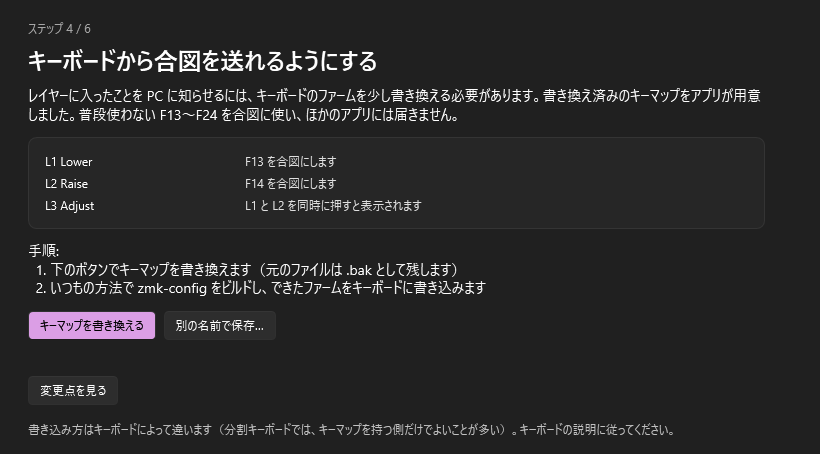
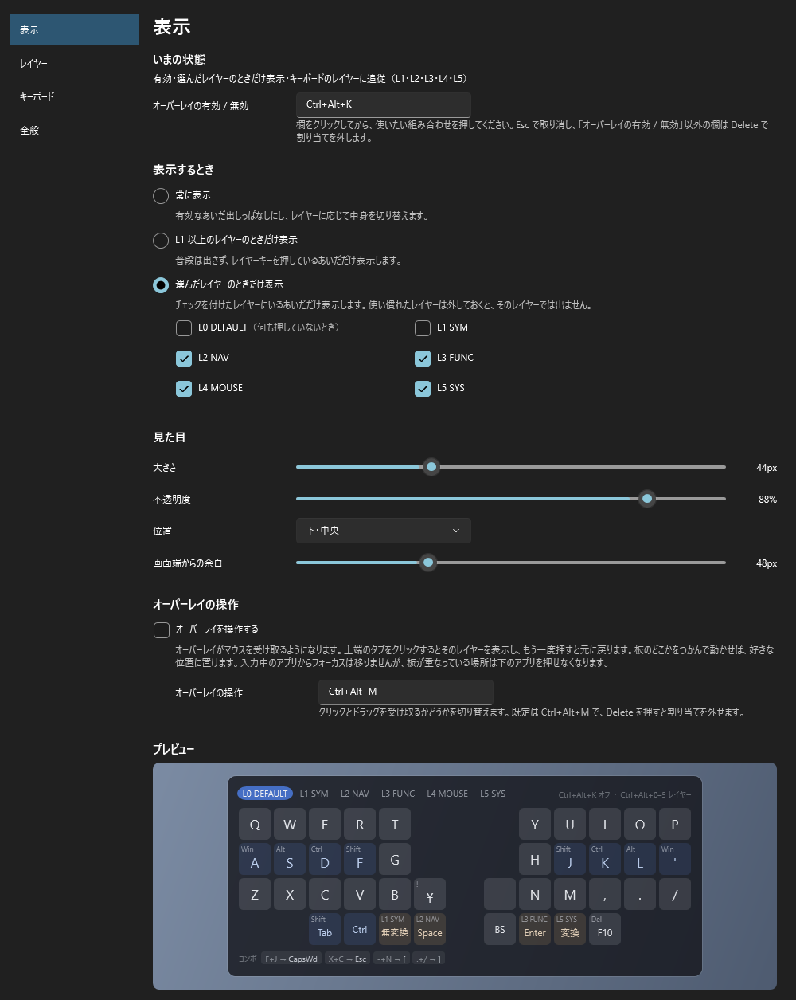

# ZMK Keymap Overlay

[ZMK](https://zmk.dev/) キーボードのキーマップを、Windows の画面の端に半透明で表示する常駐アプリ。
レイヤーキーを押しているあいだ、そのレイヤーの配置が出る。



[English](README.md)

## できること

- キーマップを画面の端に出しっぱなしにできる（既定）。レイヤーキーを押しているあいだだけ、または選んだレイヤーのときだけの表示にも切り替えられる（覚えたレイヤーでは出さない）
- zmk-config を直接読む。GitHub の URL を貼るだけでも、PC の `.keymap` を選んでもよい
- キーの並び（物理レイアウト）を自動で用意する
  - zmk-config の中にあれば、それを使う
  - Corne・Lily58・Sofle など、定義が ZMK 本体にあるキーボードは、ZMK 本体から取ってくる
  - どちらも無ければ、キーマップの書き方から推定する（推定したことは画面に出る）
- キーボードがレイヤーの合図を送れるよう、書き換えたキーマップをアプリが作る
- ショートカットでも各レイヤーを表示できる（組み合わせは変えられる）
- 普段はクリックを素通しするが、受け取る設定にもできる。そのあいだは、上端のタブをクリックしてレイヤーを選んだり、ドラッグで好きな位置へ動かしたりできる（フォーカスは奪わない）
- 日本語 / 英語。設定と初期設定の画面は Windows のライト / ダークに追従する
- 管理者権限もインストーラもレジストリも使わない。キー入力を監視する仕組み（キーボードフック）は使わない

## 動作環境

- Windows 10 / 11（64 ビット）
- ZMK Firmware で動くキーボード

## 導入

1. [Releases](../../releases) から `ZmkOverlay-<バージョン>-win-x64.zip` をダウンロードする
2. zip を右クリック →「すべて展開」。フォルダは好きな場所（例: ドキュメントの中）に置く
3. `ZmkOverlay.exe` をダブルクリックする
   - 「**Windows によって PC が保護されました**」と出たら、「**詳細情報**」→「**実行**」を押す。
     コード署名をしていないアプリのため出る
4. 初期設定の案内が開くので、順に進める

.NET のインストールは要らない（アプリに同梱している）。
起動中にもう一度 `ZmkOverlay.exe` を開くと、2 つ目は起動せず、設定画面が開く。



## 初期設定の流れ

1. **キーマップの場所** — GitHub の URL / この PC の `.keymap` / サンプル
2. **キーボードの形** — プレビューで確かめる。並びが違えば「**ZMK 本体から取得**」を押すか、キーの並びが書かれた `.dtsi` を選ぶ
3. **キーボードの書き換え**（試験的） — 下記
4. **動作確認**
5. **完了**

トレイのメニューの「**初期設定をやり直す…**」から、いつでもやり直せる。

### キーボードを書き換える理由

ZMK のレイヤーの切り替えはキーボードの中で完結していて、PC には伝わらない。
そこで、レイヤーに入っているあいだ、ふだん使わない F13〜F24 のどれかを一緒に押し続けるよう、
ファームを少し書き換える。アプリはこのキーを受け取って表示を切り替え、ほかのアプリには届かないよう押さえる。

- 書き換え済みのキーマップはアプリが作る。GitHub なら、コピーして編集画面に貼り付け、Commit するだけ
- 押し心地は変わらない（ZMK 組み込みの `&lt` と同じ設定にしてある）
- Lower と Raise を同時に押すと入る Adjust のような「条件付きレイヤー」も、組み合わせを押しているあいだ表示される
- **試験的な機能。** 書き換えたキーマップがビルドできることと、作者のキーボードで動くことは確かめたが、
  ほかのキーボードではまだ確かめていない。結果を[知らせてもらえる](#結果の報告)と助かる
- **書き換える前に、今のファームを保存しておくこと**。うまくいかなくても書き戻せる
- **ビルドが失敗したら書き込まない。** 初期設定の「うまくいかなかったとき」で、キーマップから書き換えを取り除ける
  （GitHub なら、取り除いた内容をコピーして編集画面を開く）
- **同じキーボードを別の PC でも使う場合。** 合図キーは、このアプリが動いていない PC にもそのまま届く。
  Mac では F14 / F15 で画面の明るさが変わり、Linux では F20 でマイクがミュートされ、F21 でタッチパッドが切り替わることがある。
  アプリはこの 4 つを、ほかの F キーが足りないときだけ使う
- 書き換えなくても、ショートカットやトレイのメニューからレイヤーを表示できる



### 結果の報告

キーボードの書き換えを試したら、うまくいってもいかなくても、
[報告のページ](https://github.com/utori7/zmk-keymap-overlay/issues/new?template=keyboard-update.yml)から知らせてほしい。
初期設定の「動作確認」の「結果を報告する」や、「うまくいかなかったとき」の「問題を報告する」から開くと、
キーボード名と ZMK の版が最初から入っている。

- 書いてほしいこと: 結果、キーボード、ZMK の版、GitHub で書き換えたか PC のファイルを書き換えたか
- ビルドが通らないときは、Actions の赤い × の付いたジョブのエラー
- 動いたという報告がいくつかのキーボードから集まり、大きな問題が出なくなったら「試験的」を外す

## 使い方

- **画面右下のトレイのアイコンを左クリック**するとメニューが開く。
  アイコンが見当たらなければ、タスクバーの「**^**」の中にある
- **Ctrl+Alt+K** で有効 / 無効
- **Ctrl+Alt+M** でオーバーレイがマウスを受け取る。上端のタブをクリックしてレイヤーを選び、ドラッグで好きな位置へ動かせる
- **Ctrl+Alt+数字** でレイヤーを表示（設定で変えられる）
- **設定画面**（トレイ →「設定…」）
  - 表示: 表示するとき（どのレイヤーで出すかも選べる）・大きさ・不透明度・位置・上の 2 つのショートカット
  - レイヤー: キーボードのレイヤーへの追従・レイヤー名・合図キー・レイヤーごとのショートカット
  - キーボード: キーマップの読み込み元・キーの並び・PC の配列（JIS / US）
  - 全般: 表示言語・サインイン時の起動

ドイツ語配列のように AltGr（= Ctrl+Alt）で記号を打つ配列では、Ctrl+Alt の組み合わせを押さえると記号が打てなくなる。
そのため、文字の入力に使われる組み合わせはショートカットにしない（有効 / 無効は Ctrl+Alt+Shift+K などになり、
Ctrl+Alt+数字 は割り当てない）。設定画面で別の組み合わせを選べる。



## 通信について

次の操作をしたときだけ、GitHub（`api.github.com` / `raw.githubusercontent.com`）からファイルを取ってくる。
起動時には通信しない。キー入力やその他の情報を送ることはない。

「結果を報告する」「問題を報告する」は、ブラウザで GitHub の報告ページを開くだけ。
キーボード名・ZMK の版・アプリのバージョンを入力欄に入れておくが、送るかどうかは開いたページで決められる。

- 設定画面・初期設定の「取得」「取り直す」
- 初期設定の「コピーして GitHub の編集画面を開く」「取り直して確かめる」「書き換えを取り除いてコピーし、編集画面を開く」
  （貼り付ける直前に最新の内容を取るため）
- 「ZMK 本体から取得」（ZMK 本体 `zmkfirmware/zmk` からキーの並びを取る）。
  GitHub から取得したとき、zmk-config にキーの並びが無ければ、同じ操作の中で自動で取りに行く
- GitHub から読んでいる状態での、トレイの「キーマップを再読み込み」

## 設定ファイル

`config.json` は `ZmkOverlay.exe` と同じフォルダにある（そこに書けなければ `%APPDATA%\ZmkOverlay\`）。
ふつうは設定画面から変えればよい。項目の一覧は [docs/configuration.ja.md](docs/configuration.ja.md)
（設定画面の「全般」→「このアプリについて」からも開ける）。

## アンインストール

1. 「Windows のサインイン時に起動する」をオンにしていたら、先に設定画面の「全般」でオフにする
   （または `shell:startup` のショートカットを消す）
2. トレイのメニューから「終了」
3. フォルダごと削除する。レジストリには何も書いていない

## よくある質問

- **ショートカットが効かない** — 他のアプリが同じ組み合わせを使っている。オーバーレイの有効 / 無効と操作は設定画面の「表示」、レイヤーごとのものは「レイヤー」で変える
- **一部のレイヤーに追従しない** — 初期設定の「キーボードの書き換え」に理由が出る（`&tog` で入るレイヤーなど）
- **キーの並びが違う** — 設定画面の「キーボード」で「ZMK 本体から取得」を試す（シールド名は build.yaml に書いてある）。
  自作のキーボードなら、物理レイアウトにキーの並びが書かれた `.dtsi` を選ぶ
- **起動したらサンプルが表示された** — 設定したキーマップが読めなかった（ファイルを移した、など）。
  開いた初期設定から、キーマップの場所を選び直す。設定ファイルが壊れていた場合は、`config.broken-<日時>.json` に移して作り直している
- **`ZMK_LAYER(...)` などのマクロ（zmk-helpers）で書いたキーマップ** — まだ読めない。`keymap { ... }` の形で書かれたキーマップが必要
- **zmk-config が非公開** — GitHub からは読めない。PC にダウンロードして `.keymap` を選ぶ
- **会社の PC で使えるか** — 管理者権限もインストーラも要らず、キーボードフックも使っていない。
  ただし社内の規則には従うこと

## 自分でビルドする

.NET 10 SDK が要る。

```bash
dotnet build
dotnet test
powershell -File tools/publish.ps1
```

詳しくは [docs/development.md](docs/development.md) と [DESIGN.md](DESIGN.md)。

## ライセンス

[MIT](LICENSE)。同梱しているもの（.NET ランタイム、ZMK 由来のキー配置データ）については
[THIRD-PARTY-NOTICES.md](THIRD-PARTY-NOTICES.md) を参照。
