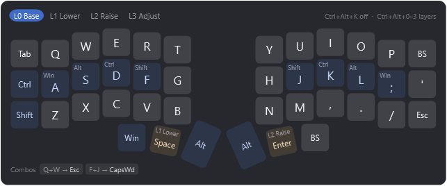
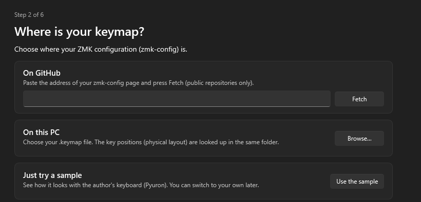
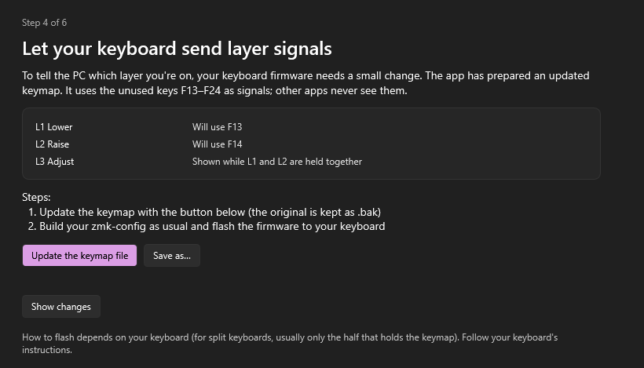
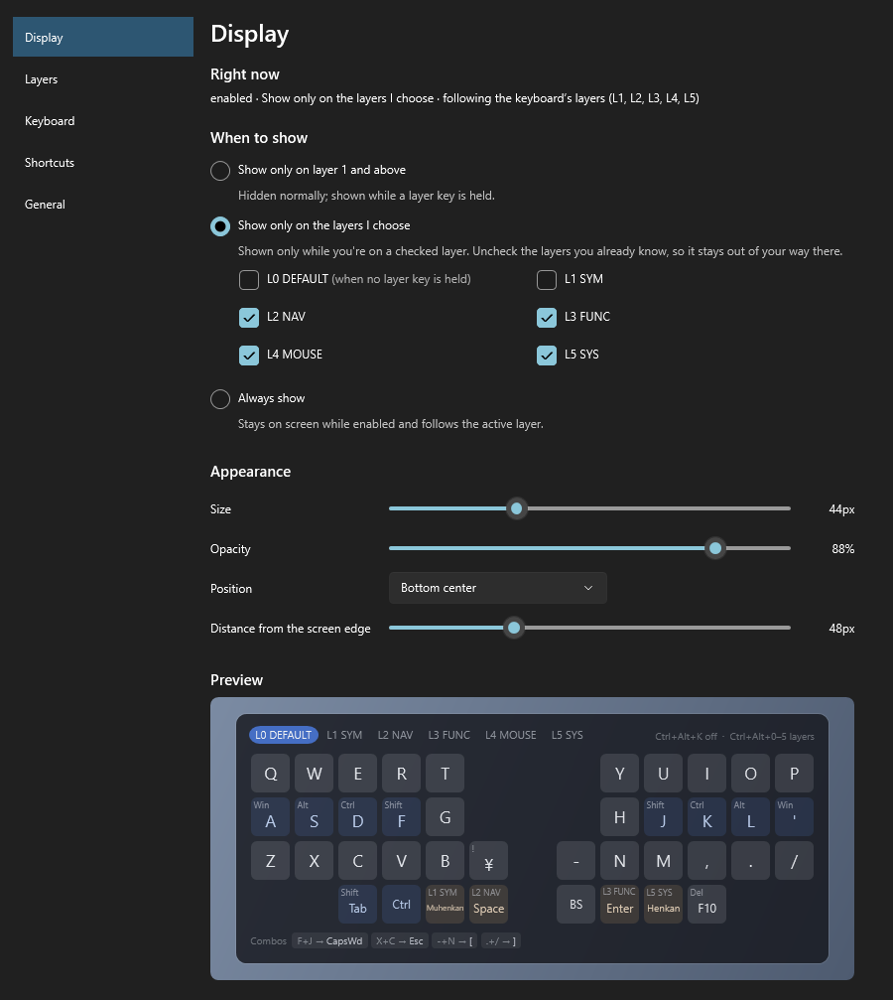

# ZMK Keymap Overlay

A small Windows tray app that shows your [ZMK](https://zmk.dev/) keyboard's keymap on the edge of the screen.
While you hold a layer key, that layer's keys appear.



[日本語](README.ja.md)

## Features

- Shows a layer only while its layer key is held. You can also keep it on screen all the time, or show it only on the layers you pick, leaving out the ones you already know
- Reads your zmk-config directly — just paste the GitHub URL, or pick a `.keymap` file on your PC
- Works out where the keys are (the physical layout)
  - uses the one in your zmk-config if there is one
  - for keyboards defined in ZMK itself, such as Corne, Lily58 and Sofle, downloads it from ZMK
  - otherwise guesses it from how the keymap is written (and tells you it guessed)
- Prepares an updated keymap so your keyboard can tell the PC which layer is active
- Shows any layer with a shortcut too (you can choose the combinations)
- Clicks pass through by default, but you can let the overlay take them: click a tab along the top to pick a layer, or drag the overlay wherever you want it (it still never takes focus)
- English / Japanese; the settings and setup windows follow Windows' light / dark theme
- No administrator rights, no installer, no registry. It does **not** use a keyboard hook to watch your typing

## Requirements

- Windows 10 or 11 (64-bit)
- A keyboard running ZMK Firmware

## Install

1. Download `ZmkOverlay-<version>-win-x64.zip` from [Releases](../../releases)
2. Right-click the zip → **Extract All**, and put the folder anywhere you like (for example in Documents)
3. Double-click `ZmkOverlay.exe`
   - If Windows says **"Windows protected your PC"**, click **More info** → **Run anyway**.
     This appears because the app is not code-signed.
4. The setup guide opens. Follow it step by step

You don't need to install .NET; it is included.
Opening `ZmkOverlay.exe` again while it is running opens Settings instead of starting a second copy.



## Setup guide

1. **Where is your keymap?** — a GitHub URL, a `.keymap` file on this PC, or a sample
2. **Does this look like your keyboard?** — check the preview; if the keys are misplaced, press **Get from ZMK**,
   or choose a `.dtsi` file that describes the key positions
3. **Let your keyboard send layer signals** (experimental) — see below
4. **Try it out**
5. **Done**

You can run it again any time from the tray menu (**Run setup again…**).

### Why the keyboard needs a small change

ZMK switches layers inside the keyboard, so the PC never hears about it.
The app therefore asks the keyboard to also hold one of the unused keys F13–F24 while a layer is active.
The app listens for these keys to switch the overlay, and reserves them so no other app sees them.

- The app prepares the updated keymap for you. On GitHub, you just copy it into the editor and commit
- Typing feel stays the same (it uses the same settings as ZMK's built-in `&lt`)
- Conditional layers, such as an Adjust layer entered by holding Lower and Raise together, are shown too
- **This is experimental.** Updated keymaps are known to build and to work on the author's keyboard,
  but haven't been tried on other keyboards yet. Please [tell us how it went](#reporting-results)
- **Save your current firmware first**, so you can go back if needed
- **If the build fails, don't flash it.** "If something goes wrong" in the setup guide removes the changes from your keymap
  (on GitHub, it copies your keymap without them and opens the editor)
- **Using the same keyboard on other computers.** The signal keys also reach computers that don't run this app.
  On a Mac, F14 / F15 change the screen brightness; on Linux, F20 may mute the microphone and F21 may toggle the touchpad.
  The app uses these four only when it runs out of other F keys
- Without the change, you can still show layers with shortcuts or from the tray menu



### Reporting results

If you tried updating your keyboard, please tell us how it went — whether it worked or not — on the
[report page](https://github.com/utori7/zmk-keymap-overlay/issues/new?template=keyboard-update.yml).
If you open it with **Report the result** in the setup guide's "Try it out" step, or **Report the problem** under
"If something goes wrong", your keyboard and ZMK version are already filled in.

- Please include: the result, your keyboard, the ZMK version, and whether you updated on GitHub or a file on your PC
- If the build fails, include the error from the job with the red cross in Actions
- Once it has worked on several keyboards and no serious problems remain, it will stop being experimental

## Using it

- **Left-click the tray icon** (bottom right of the screen) for the menu.
  If you can't see it, it is under **^** on the taskbar
- **Ctrl+Alt+K** turns the overlay on and off
- **Ctrl+Alt+number** shows a layer (you can change these in Settings)
- **Settings** (tray → Settings…)
  - Display: when to show (including which layers), size, opacity, position
  - Layers: following the keyboard's layers, layer names, signal keys
  - Keyboard: where your keymap comes from, key positions, this PC's layout (JIS / US)
  - Shortcuts, and General: language, start when signing in

On layouts that type symbols with AltGr (which Windows treats as Ctrl+Alt), such as German, holding a Ctrl+Alt
combination as a shortcut would stop you typing those symbols. The app never takes a combination that types a
character: the on/off shortcut becomes Ctrl+Alt+Shift+K or similar, and Ctrl+Alt+number is left unassigned.
You can pick other combinations in Settings.



## Network use

The app downloads files from GitHub (`api.github.com` and `raw.githubusercontent.com`) only when you:

- press **Fetch** or **Fetch again** in Settings or the setup guide
- press **Copy and open GitHub's editor**, **Fetch again and check** or
  **Copy without the changes and open GitHub's editor** in the setup guide
  (it takes the latest keymap right before you paste)
- press **Get from ZMK**, which downloads the key positions from ZMK itself (`zmkfirmware/zmk`).
  When you fetch from GitHub and your zmk-config has no key positions, this happens as part of the same fetch
- choose **Reload keymap** in the tray while your keymap comes from GitHub

It never connects at startup, and it never sends your keystrokes or anything else.

**Report the result** and **Report the problem** only open GitHub's report page in your browser.
They fill in your keyboard, ZMK version and app version; whether to submit is up to you on that page.

## Settings file

`config.json` lives next to `ZmkOverlay.exe` (or in `%APPDATA%\ZmkOverlay\` if that folder is not writable).
You normally change everything in Settings. For the full list of keys, see
[docs/configuration.md](docs/configuration.md). You can also open it from
Settings → General → About.

## Uninstall

1. If you turned on **Start when I sign in to Windows**, turn it off in Settings → General first
   (or delete the shortcut in `shell:startup`)
2. Choose **Exit** from the tray menu
3. Delete the folder. Nothing is written to the registry

## FAQ

- **A shortcut does nothing** — another app is probably using the same combination. Pick another one in Settings → Shortcuts
- **Some layers are not followed** — the setup guide's "layer signals" step tells you why
  (for example, layers entered with `&tog`)
- **The keys are in the wrong places** — in Settings → Keyboard, try **Get from ZMK** (the shield name is in your build.yaml).
  For a custom keyboard, choose a `.dtsi` file that describes the key positions
- **The app shows the sample keyboard** — your keymap could not be loaded (for example, the file was moved).
  Choose it again in the setup guide that opens. If the settings file itself was broken, it was moved to
  `config.broken-<date>.json` and a new one was created
- **My keymap uses macros such as `ZMK_LAYER(...)` (zmk-helpers)** — not supported yet. The keymap needs to be written as `keymap { ... }`
- **My zmk-config is private** — the app can't read private repositories. Download the files and choose the `.keymap` on your PC
- **Can I use it on a work PC?** — it needs no administrator rights or installer and uses no keyboard hook,
  but follow your company's rules

## Building from source

You need the .NET 10 SDK.

```bash
dotnet build
dotnet test
powershell -File tools/publish.ps1
```

See [docs/development.md](docs/development.md) and [DESIGN.md](DESIGN.md) (both in Japanese).

## License

[MIT](LICENSE). For what the app bundles (the .NET runtime and key-position data from ZMK), see
[THIRD-PARTY-NOTICES.md](THIRD-PARTY-NOTICES.md).
